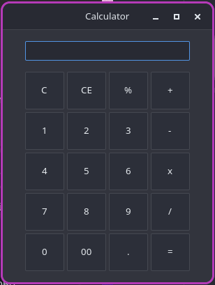

# EN: How to install and launch it?
```pip install -r requirements.txt```, then ```python main.py```. 
I don't know, will it work without installed gtk4 in system, so say me in Issues.

# RU: Как установить и запустить?
Думаю, как скачать репозиторий вы и без меня разберетесь. Сначала, установите зависимости: ```pip install -r requirements.txt```, и запустите: ```python main.py```.
Я не знаю, будет ли он работать без установленного gtk4 в системе, если кто проверит, отпишитесь в Issues.

